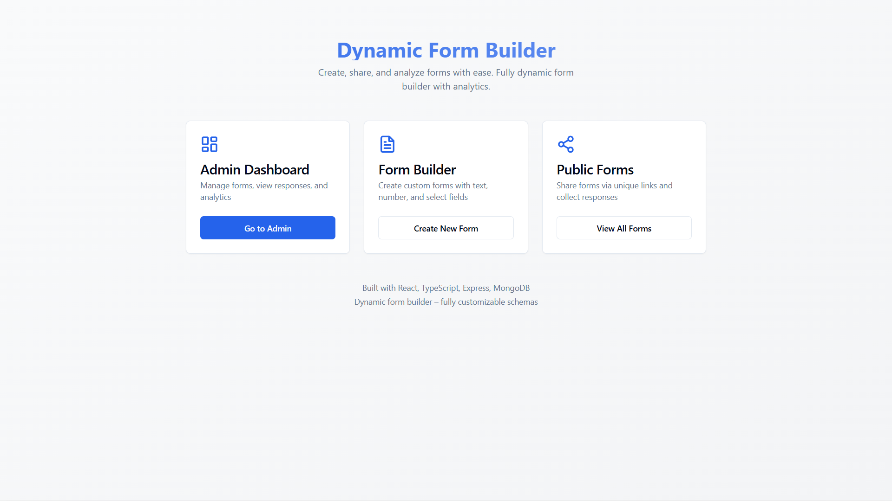
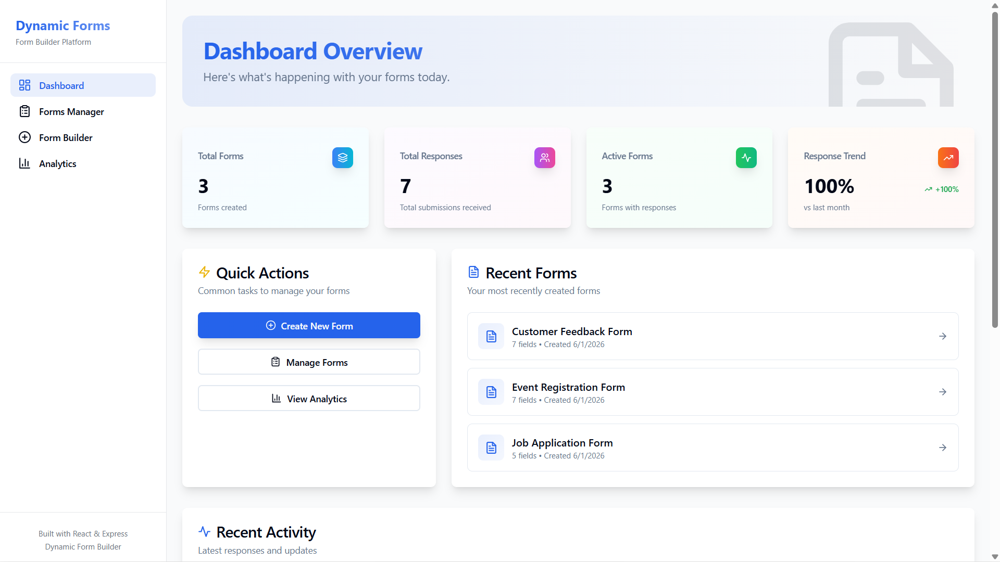
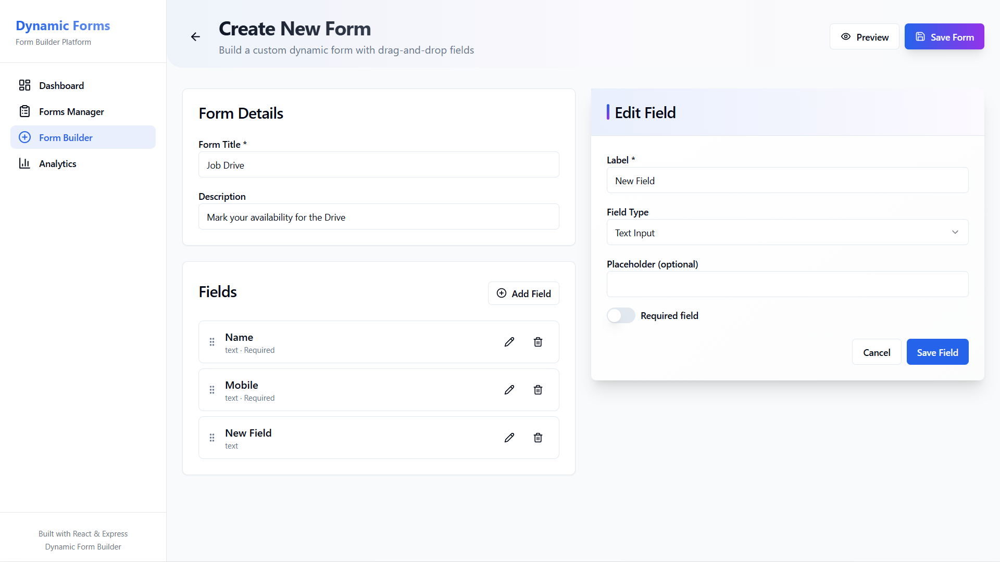
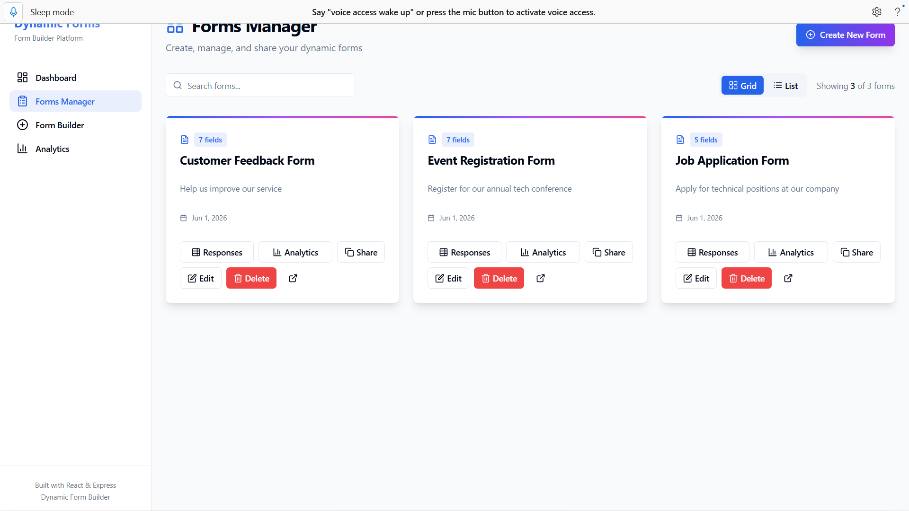
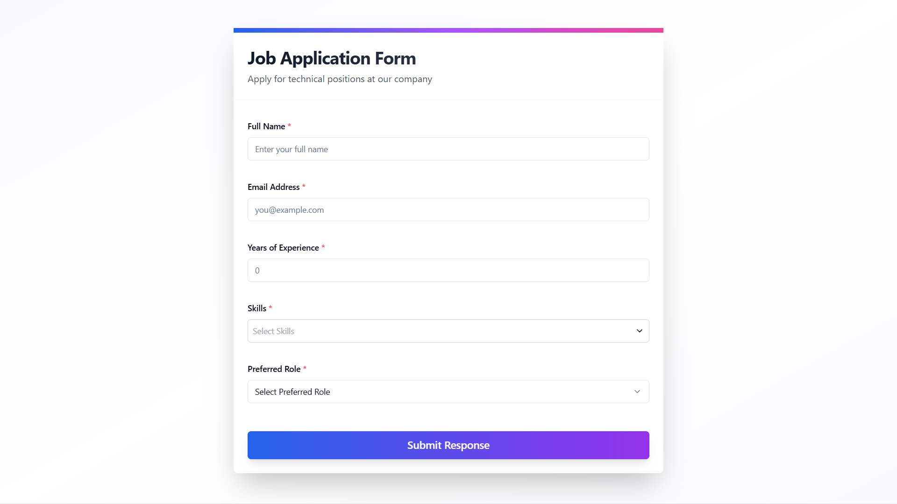
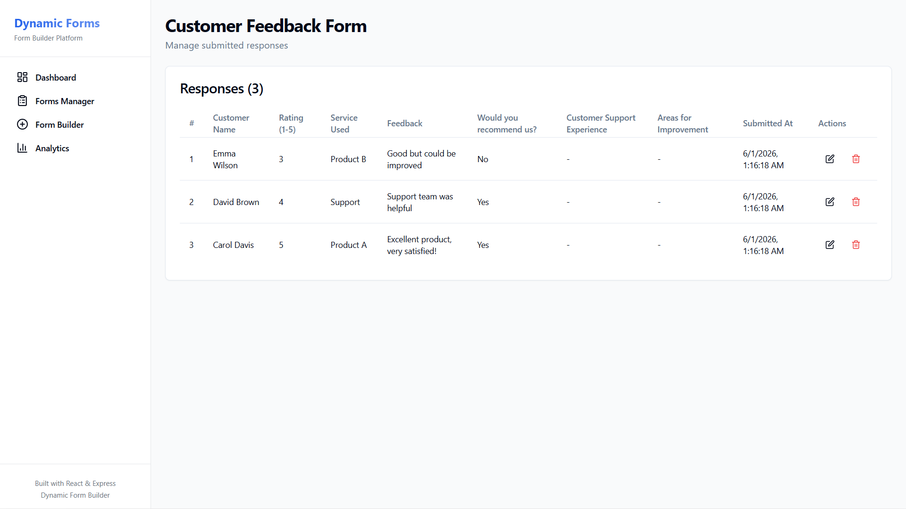
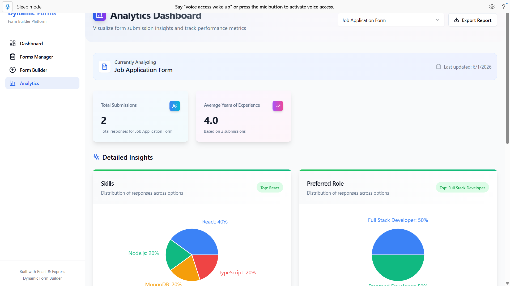
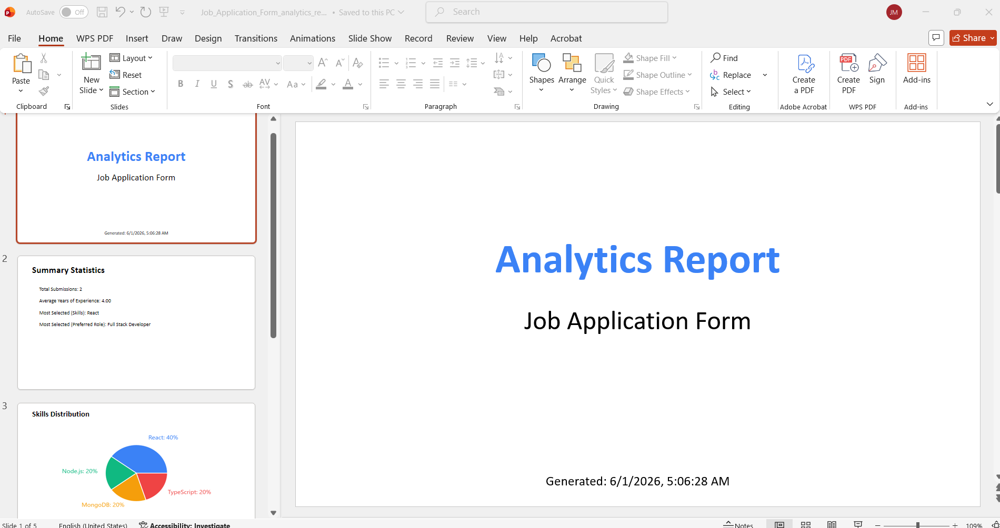

# 🚀 Dynamic Form Builder

A production-ready full-stack application for creating, managing, sharing, and analyzing dynamic forms. The platform enables administrators to build custom forms without code, collect responses through public links, and gain actionable insights through analytics dashboards and exportable reports.

---

## 🌐 Live Demo

| Service | Link |
|----------|----------|
| Frontend | https://dynamic-forms-builder.onrender.com |
| Backend API | https://dynamic-form-builder-5tqp.onrender.com |

---

## ✨ Highlights

### Form Builder
- Create forms dynamically using configurable field definitions
- Support for:
  - Text
  - Textarea
  - Number
  - Date
  - Select
  - Radio
  - Checkbox
- Required field validation
- Shareable public form links

### Response Management
- Dynamic response storage based on form schema
- View, edit, and delete submissions
- Dynamic table columns generated from form fields

### Analytics
- Submission metrics and KPIs
- Option distribution analysis
- Numeric field averages
- Interactive charts using Recharts
- Export reports in PDF, DOCX, PPTX, and CSV formats

### User Experience
- Responsive design
- Grid and list layouts
- Debounced search
- Local caching
- Loading, error, and empty states

---

# 🏗️ Architecture

```text
┌──────────────────────────────────────────────┐
│ React + TypeScript Frontend                  │
│                                              │
│ • Admin Dashboard                            │
│ • Form Builder                               │
│ • Response Viewer                            │
│ • Analytics Dashboard                        │
│ • Public Form Renderer                       │
└──────────────────────┬───────────────────────┘
                       │ REST API
                       ▼
┌──────────────────────────────────────────────┐
│ Express.js Backend                           │
│                                              │
│ • Routes                                     │
│ • Controllers                                │
│ • Middleware                                 │
│ • Services                                   │
│ • Validation                                 │
└──────────────────────┬───────────────────────┘
                       │
                       ▼
┌──────────────────────────────────────────────┐
│ MongoDB Atlas                                │
│                                              │
│ • Forms                                      │
│ • Responses                                  │
│ • Users                                      │
└──────────────────────────────────────────────┘
```

---

## 📁 Project Structure

```text
dynamic-form-builder
│
├── backend
│   ├── src
│   │   ├── config
│   │   ├── controllers
│   │   ├── middleware
│   │   ├── models
│   │   ├── routes
│   │   ├── services
│   │   ├── utils
│   │   ├── app.js
│   │   └── server.js
│   ├── seed.js
│   └── package.json
│
├── frontend
│   ├── src
│   │   ├── components
│   │   ├── features
│   │   ├── hooks
│   │   ├── services
│   │   ├── store
│   │   ├── types
│   │   └── utils
│   └── package.json
│
└── README.md
```

---

## 🔄 Application Flow

### Form Creation

```text
Admin
  → Create Form
  → Configure Fields
  → Save Schema
  → Generate Shareable Link
```

### Form Submission

```text
Public User
  → Open Shared Link
  → Fill Form
  → Submit Response
  → Validation
  → Store in Database
```

### Analytics

```text
Admin
  → Select Form
  → Analytics API
  → Aggregation Engine
  → Charts & Insights
```

---

## 🗄️ Database Design

### Forms Collection

```json
{
  "_id": "ObjectId",
  "title": "Job Application",
  "description": "Form description",
  "fields": [],
  "shareableId": "abc123xyz",
  "createdAt": "ISO Date"
}
```

### Responses Collection

```json
{
  "_id": "ObjectId",
  "formId": "ObjectId",
  "answers": {
    "field_1": "John Doe",
    "field_2": 5,
    "field_3": ["React", "Node.js"]
  },
  "submittedAt": "ISO Date"
}
```

---

## 🛠️ Technology Stack

### Frontend
- React 18
- TypeScript
- Redux Toolkit
- React Hook Form
- Tailwind CSS
- shadcn/ui
- Recharts
- Axios

### Backend
- Node.js
- Express.js
- MongoDB Atlas
- Mongoose
- JWT Authentication
- bcryptjs

### Deployment
- Render
- MongoDB Atlas
- GitHub

---

## 📸 Screenshots

> Replace the placeholders below with actual project screenshots.

### Landing Page


### Admin Dashboard


### Form Builder


### Forms Manager


### Public Form


### Response Viewer


### Analytics Dashboard


### Export Reports


### Mobile View


---

## 🚀 Installation

### Backend

```bash
git clone <repository-url>

cd backend

npm install

npm run seed

npm run dev
```

### Frontend

```bash
cd frontend

npm install

npm run dev
```

---

## 🔧 Environment Variables

### Backend

```env
PORT=5000
MONGODB_URI=your_mongodb_connection_string
JWT_SECRET=your_secret_key
NODE_ENV=production
```

### Frontend

```env
VITE_API_URL=http://localhost:5000/api
```

---

## 📡 API Overview

### Forms

| Method | Endpoint |
|----------|----------|
| GET | /api/forms |
| GET | /api/forms/:id |
| GET | /api/forms/share/:shareableId |
| POST | /api/forms |
| PUT | /api/forms/:id |
| DELETE | /api/forms/:id |

### Responses

| Method | Endpoint |
|----------|----------|
| GET | /api/responses/form/:formId |
| POST | /api/responses |
| PUT | /api/responses/:id |
| DELETE | /api/responses/:id |

### Analytics

| Method | Endpoint |
|----------|----------|
| GET | /api/analytics/:formId |
| GET | /api/analytics/dashboard/stats |

---

## ✅ Key Capabilities

- Dynamic form schema management
- Public form sharing
- Dynamic response rendering
- Analytics engine
- Exportable reports
- Responsive UI
- State management with Redux Toolkit
- Local storage caching
- Optimized search experience

---

## 🔮 Future Enhancements

- Drag-and-drop builder
- Conditional fields
- File upload support
- Email notifications
- Webhook integrations
- Form templates
- Pagination
- Advanced permissions
- Dark mode

---

## 👨‍💻 Author

**Joseph Mathew Aikara**

- GitHub: https://github.com/Josephmathew072
- LinkedIn: https://www.linkedin.com/in/joseph-mathew-aikara/
- Email: josephmathew072@gmail.com

---

## 📄 License

MIT License
